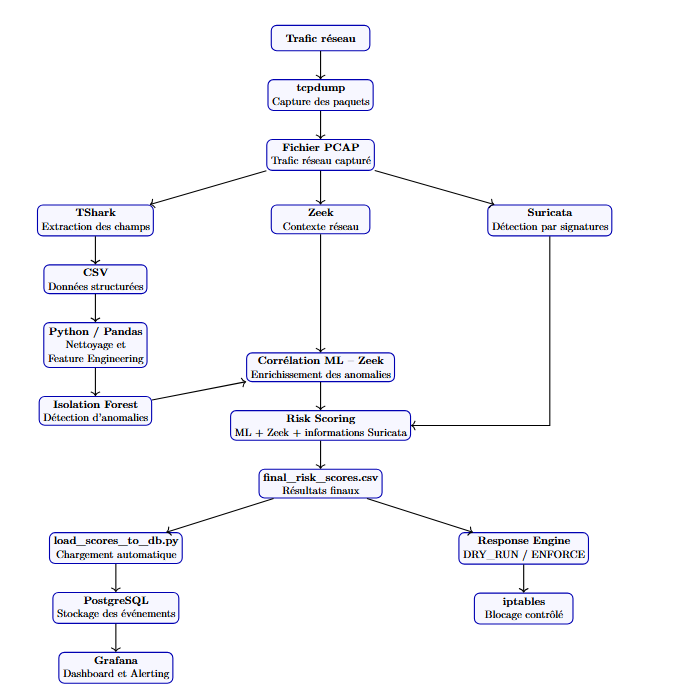

# Intelligent NDR Prototype

Prototype of a Network Detection and Response (NDR) platform combining anomaly detection, network analysis, risk scoring, visualization and controlled automated response.

## Project Overview

This project was developed as a proof of concept in a virtualized laboratory environment.

The objective is to analyze network traffic, detect unusual behaviors, contextualize anomalies and assign a risk level to observed network events.

The prototype combines several complementary technologies:

- TShark for network feature extraction
- Python and Pandas for data preprocessing
- Isolation Forest for anomaly detection
- Zeek for contextual network analysis
- Suricata for signature-based detection
- PostgreSQL for event storage
- Grafana for visualization and alerting
- iptables for controlled automated response

## Architecture
The prototype follows a modular NDR architecture combining network traffic
analysis, Machine Learning, contextual analysis, risk scoring, visualization
and controlled automated response.




## Main Features

- Network traffic analysis from PCAP files
- Feature engineering for Machine Learning
- Unsupervised anomaly detection using Isolation Forest
- Contextual analysis using Zeek
- Signature-based detection using Suricata
- ML-Zeek event correlation
- Heuristic risk scoring
- PostgreSQL event storage
- Grafana dashboard and alerting
- Controlled response engine with DRY_RUN and ENFORCE modes
- Automated Bash pipeline

## Dashboard

The detected network events and their associated risk levels are stored in
PostgreSQL and visualized through a Grafana dashboard.

The dashboard provides:
- Total number of NDR events
- Distribution by risk level
- Connection details
- Risk score for each analyzed connection


## Project Structure

```text
scripts/
├── analyze_traffic.py
├── correlate_ml_zeek.py
├── detect_anomalies.py
├── load_scores_to_db.py
├── prepare_dataset.py
├── prepare_response_test.py
├── prepare_test.py
├── response_engine.py
├── risk_scoring.py
├── run_ndr_full_pipeline.sh
├── run_ndr_pipeline.sh
└── train_model.py
